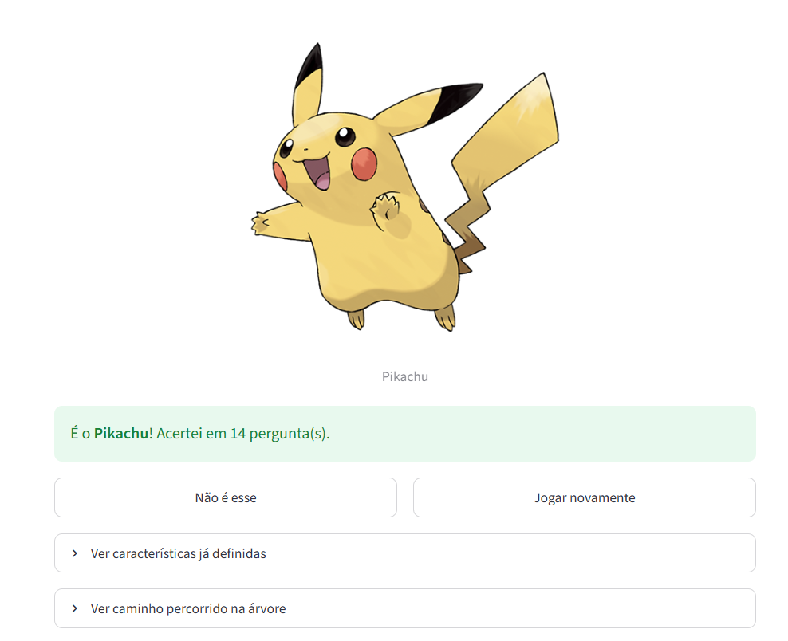
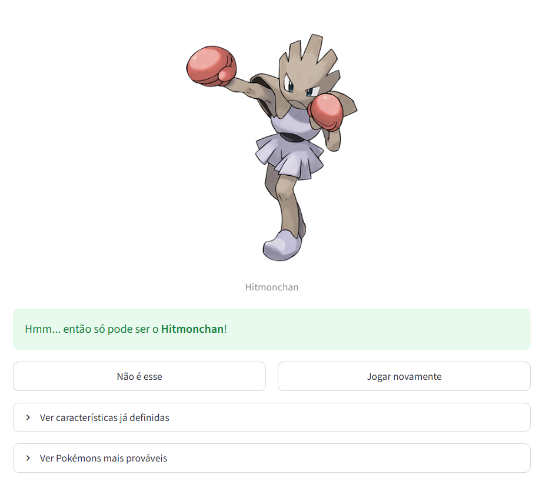

# Pokinator

<p align="center">
  
</p>

**Disciplina:** Introdução à Inteligência Artificial
**Semestre:** 2026.1
**Professor:** André Fonseca
**Turma:** T04

## Integrantes do Grupo

- Allyson Carvalho Silva Santos (20260001830) — css.allyson@gmail.com
- Edson Gabriel Ferreira Gomes (20200047069) — edsongabriel2000.eg@gmail.com
- Renan Ribeiro Taveira de Souza (20200119355) — renan.ribeiro.taveira@gmail.com

## Descrição do Projeto

O **Pokinator** é um agente inteligente que adivinha qual Pokémon o usuário está
pensando a partir de uma sequência de perguntas de sim/não, no estilo do Akinator.
O projeto implementa e **compara duas abordagens de classificação** para a mesma
tarefa: uma **Árvore de Decisão** (que percorre um caminho fixo de perguntas até
uma folha) e um **Naive Bayes** (que a cada passo escolhe a pergunta mais
informativa e atualiza as probabilidades de cada Pokémon pela regra de Bayes,
parando ao atingir 80% de certeza).

Os modelos são treinados sobre os **1025 Pokémon** com **68 atributos booleanos**
(tipo, cor, forma, habitat, geração, tamanho e estágio evolutivo), coletados da
**PokéAPI** e pré-processados em notebooks. As tecnologias utilizadas são
**Python**, **scikit-learn** (treino e inferência dos modelos), **pandas**
(manipulação dos dados), **Streamlit** (interface web) e **uv** (gerenciamento de
dependências e tasks). A PokéAPI também é consultada em tempo de execução para
exibir a arte oficial do Pokémon adivinhado.

## Guia de Instalação e Execução

### 1. Instalação das Dependências

Certifique-se de ter o **Python 3.11+** e o gerenciador
[**uv**](https://docs.astral.sh/uv/) instalados. Clone o repositório e sincronize
as dependências (definidas em `pyproject.toml`/`uv.lock`):

```bash
git clone https://github.com/css-allyson/Pokinator.git
cd Pokinator
uv sync

# (opcional) dependências de desenvolvimento
uv sync --group dev
```

> **Observação:** os datasets (`data/`) e os modelos treinados (`models/`) são
> gerados executando os notebooks na ordem `01` → `02` → `03`. Rode-os antes de
> iniciar a aplicação.

### 2. Como Executar

Inicie a interface web com:

```bash
uv run task app
```

A aplicação abre em http://localhost:8501. Na barra lateral é possível alternar
entre os algoritmos (Árvore de Decisão e Naive Bayes).

Para reproduzir a avaliação dos modelos no terminal:

```bash
uv run task test
```

## Estrutura dos Arquivos

- `backend/`: Código-fonte do agente — carga dos modelos treinados e a lógica de
  jogo de cada algoritmo (`agent.py`).
- `frontend/`: Interface web em Streamlit (`app.py`) e imagens (`assets/`).
- `notebooks/`: Coleta de dados na PokéAPI, pré-processamento e treino dos modelos
  (`01_data_collection`, `02_preprocessing`, `03_model_training`).
- `data/`: Datasets bruto (`pokemon_raw.csv`) e processado (`pokemon_processed.csv`).
- `models/`: Modelos treinados serializados (`decision_tree.pkl`, `naive_bayes.pkl`)
  e as colunas de features (`feature_columns.pkl`).
- `tests/`: Avaliação dos modelos — acurácia e número médio de perguntas
  (`evaluate_models.py`).
- `pyproject.toml` / `uv.lock`: Dependências e tasks do projeto.

## Resultados e Demonstração

Os dois modelos foram avaliados simulando uma partida para cada um dos 1025
Pokémon (responder cada pergunta com o valor real do atributo). Resultados obtidos
com `uv run task test`:

| Modelo             | Acurácia (top-1)    | Perguntas (média) |
| ------------------ | ------------------- | ----------------- |
| Árvore de Decisão  | 99,3% (1018/1025)   | ~18               |
| Naive Bayes        | 99,3% (1018/1025)   | ~11               |

Os 7 Pokémon não acertados correspondem ao **teto teórico** do problema: existem
**7 pares com atributos idênticos** (ex.: Plusle/Minun, Hitmonlee/Hitmonchan), que
nenhum modelo consegue distinguir com as features disponíveis. Os dois algoritmos
atingem esse teto; a diferença prática está na **eficiência** — o Naive Bayes
chega ao palpite com cerca de 6 perguntas a menos, em média, por escolher sempre a
pergunta mais informativa.

### Tela principal

<p align="center">
  
</p>

### Acerto na primeira tentativa

<p align="center">
  
</p>

### Acerto na segunda tentativa

<p align="center">
  
</p>

## Referências

- **PokéAPI** — documentação da API de dados de Pokémon. https://pokeapi.co
- **scikit-learn** — `DecisionTreeClassifier`. https://scikit-learn.org/stable/modules/generated/sklearn.tree.DecisionTreeClassifier.html
- **scikit-learn** — `GaussianNB`. https://scikit-learn.org/stable/modules/generated/sklearn.naive_bayes.GaussianNB.html
- Chaves, R. *Building Akinator with Python using Bayes Theorem*. Analytics Vidhya / Medium.
- Tiwari, A. (2025). *How I Built an Akinator-Style AI Using Bayes' Theorem*. Medium.
- Izaguirre, O. *Writing an Akinator-inspired app*. MCD-UNISON / Medium.
